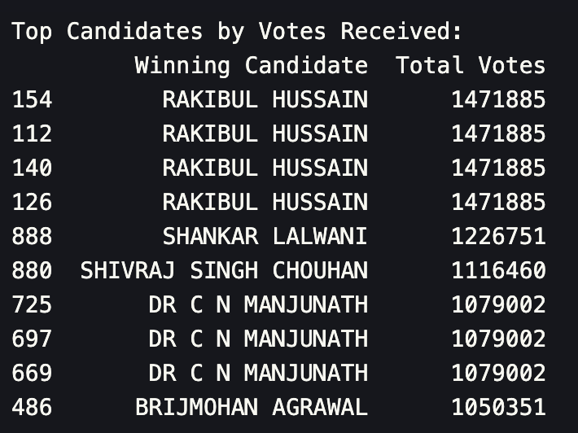
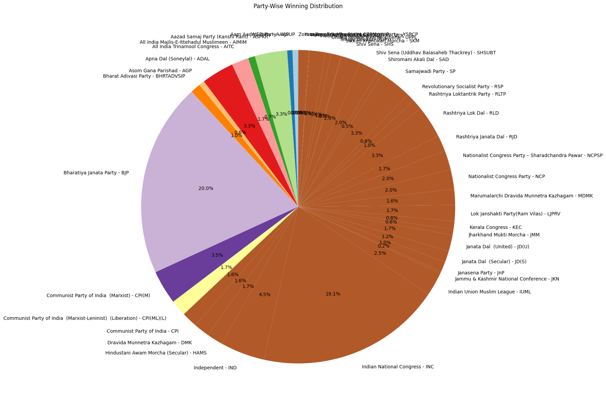

# Election Results Analysis Report

## Introduction

This report presents the results of the election data collected from the Election Commission of India's official website. The data was scraped, analyzed, and visualized to provide insights into election outcomes across various constituencies and states in India.

## Methodology

### Data Scraping

The data was scraped using Python scripts, specifically designed to interact with the election results page of the Election Commission of India. The scraping process involved extracting details such as party names, constituencies, winning candidates, total votes, and margins.

### Data Visualization

Visualizations were created to effectively represent the election data. The visual notebook utilized various libraries to plot the data, focusing on trends across different states and the performance of major parties.

## Results and Insights

### Histogram of Total Votes

This visualization provides a histogram of total votes across different constituencies, offering a visual representation of voting distribution and highlighting areas with high voter turnout.

### Top Constituencies by Margin of Victory

Identifies constituencies with the largest victory margins, which can indicate strongholds or significant shifts in voter preference.

### Dot Plot of Winning Margins by Party

A dot plot showing the winning margins for each party, illustrating the competitive landscape and dominance in various regions.

### Distribution of Wins by Party

Analyzes how the number of wins is distributed among parties, showing which parties dominated the elections and where.

### State-Wise Winning Analysis

Presents an analysis of which parties won in each state, providing insight into regional political trends and party strengths.

### Top Candidates by Votes Received

Lists the candidates who received the most votes, highlighting key figures in the election and their popularity.

### Correlation between Total Votes and Margin

Examines the relationship between the total votes a candidate received and their margin of victory, indicating how close races were.

### Election Trends by State

Focuses on electoral trends within states, such as changes in party dominance or voter turnout compared to previous elections.

### Party Wise Winning Distribution using Pie Chart

A pie chart representation of each party's share of total wins, offering a quick visual interpretation of the electoral landscape.

### Party Performance Overview (Mean, Median, Sum)

Statistical analysis of party performance, providing mean, median, and summed views of votes and margins to gauge overall and typical performances.

.png>)

## Conclusion

The detailed analysis of the election results provides valuable insights into the political landscape of India, highlighting regional variations in electoral outcomes and party strengths. The visual and statistical analysis helps in understanding the dynamics of Indian elections, offering a foundation for predicting future trends.

## Appendices

### Code Snippets

- Data scraping and preparation scripts from `election_scrapper.ipynb`
- Visualization scripts from `visual.ipynb`

## Author

**Chanakyha V** - [https://github.com/chanakyha](https://github.com/chanakyha)
